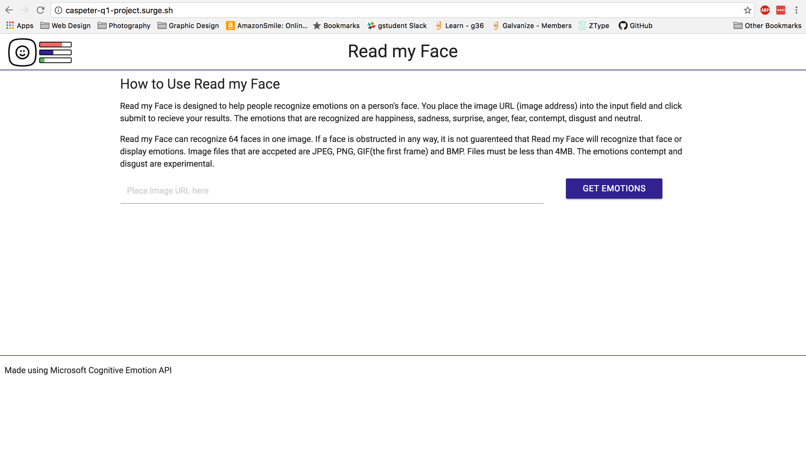
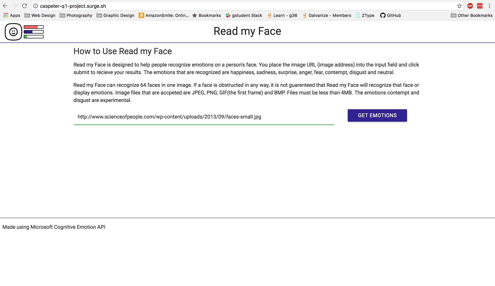
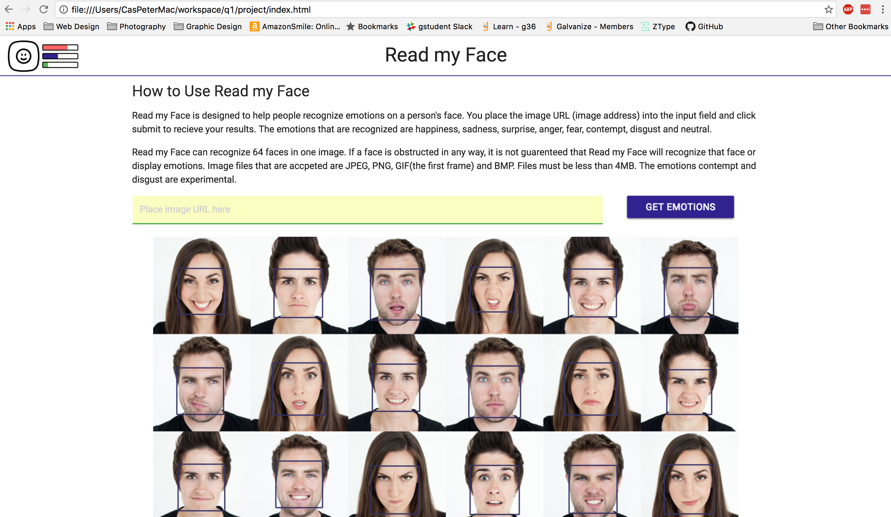
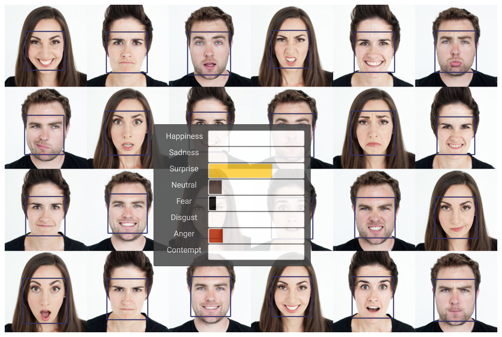

#Read my Face

Read my Face was built for everyone to use, but specifcally for people with autism or asperger syndrome. Some people with autism or aspergers have difficulty reading social cues and emotions.

This site was designed to read emotions from inputted images and display their emotions in a easy to read format.

This was created with HTML, Materialize, CSS, JavaScript, jQuery, jCanvas, jQuery UI and Microsoft Cognitive Services Emotion API.

**Live at**: [caspeter-q1-project.surge.sh](caspeter-q1-project.surge.sh)

------

This is the landing page. It is simple with very little to distract the user. It has a header with the logo and name, instructions on how to use the site, and an input area for the image URL.

The first thing to do is add an image URL.

Then submit the image with the GET EMOTIONS button and your image will appear with squares on the recognized faces.

Once you have this image displayed you can hover over any of the boxes and see their emotions.

Check out [this YouTube video](https://youtu.be/uhANx0dxOuY) for additional information:

